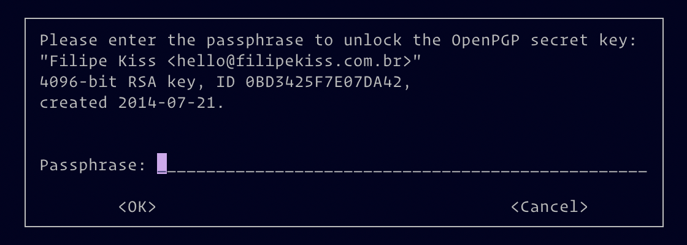

I have been signing my commits for a while now —
[even if I'm the only one in the project](https://github.com/filipekiss/dotfiles/commits/master)
— and I always struggle to explain how to setup git and GitHub to work with GPG
keys. It is not really complicated, but there are a lot of small steps and it is
hard to remember them all and in order. Since I needed to generate a new key to
use at work, I have decided to write a post about it, so I can look it up when
in doubt. This also will serve as a reference for a post about how to use
multiple GPG keys (one personal and one for work, for example) that I'll write
soon.

> ###### Disclaimer
>
> I'm going to focus on the git side of things — I'm assuming you have gnupg
> installed and working. For reference, here is the version of the software I'm
> using during the writing of this article:
>
> ```
> git --version
> git version 2.22.0
>
> gpg --version
> gpg (GnuPG) 2.2.16
> libgcrypt 1.8.4
> ```

#### Generate new key

It is pretty simple to generate a new key. Just run the command below and follow
the prompts. I have added a small explanation for each step below.

```sh
gpg --full-generate-key
```

The first option is the key type. Just use **RSA**, which is the default.

The next option is how long you want your key to be. It's called
[entropy](https://en.wikipedia.org/wiki/Password_strength#Entropy_as_a_measure_of_password_strength)
and it's basically _how unpredictable the key is_. By default, the entropy size
is 2048. You can go up to 4096 and higher numbers make it harder to crack. If
you're happy with 2048, just press `enter`.

The third option is for how long the key will be valid. It is
[good practice](https://riseup.net/en/security/message-security/openpgp/best-practices#use-an-expiration-date-less-than-two-years)
to expire your keys in less than two years. Don't worry, you're able to
"refresh" an expired key **even after it's expiration date**. I usually go for 6
months. A question confirming the expiration date (or if you really want the key
to not expire) will appear. Just press `y` and then `enter`.

> If you set your key to expire, add a reminder in your calendar a few days
> before the expiration date, so you're able to update them before they actually
> expire. You don't want to rush when it comes to your keys.

Now fill in your details — Name, email address and you can even add a comment to
help you identify the key later — and, after everything is set, just type **O**
for _Okay_

Now, add a password to you key. Make sure you remember this password (or use a
password manager). Confirm your password and your key will be generated.

To confirm the key was generated, run the following command:

```sh
gpg --list-secret-keys --keyid-format long
```

You'll get an output similar to the text below:

```
/Users/filipe/.gnupg/pubring.kbx
--------------------------------
sec   rsa2048/A5A675575744B557 2019-07-23 [SC] [expires: 2020-07-24]
BE067D6014DA532143BEE0FCA5A675575744B557
uid                 [ultimate] Test Key <test@key.com>
ssb   rsa2048/A94CC8A32216CCEE 2019-07-23 [E] [expires: 2020-07-24]
```

As you can see, right before the name there's a `[ultimate]`. Since you just
created this key in this keyring, the key is set to the highest level of trust.

From that output, you'll need to get your key identifier so we can tell git
which key it should use when signing commits.

The first line of the key (third line of the output above, just below the
dashes), the one that says `sec rsa2048…`, is the line we're interested in.
You'll need everything from the `/` until the next whitespace. In the example
above, this would be `A5A675575744B557`. This ID is needed for two reasons. The
first one is telling git which key to use. The second one is to export the key
so we can add it to GitHub.

#### Configuring git to sign your commits

Now that we have a key and GitHub already knows about this key, we need to tell
git that we want to sign all our commits from now own, using the key provided
above. Do you still have that key id? Good! Let's tell git to use it to sign our
commits:

```sh
git config user.signingkey A5A675575744B557
```

**Don't forget to use your own key id in the command above**

If everything worked out, next time you try to `git commit`, git will ask for
you key password.



#### Adding the key to your GitHub Account

Go to your settings page on GitHub and click on
[SSH and GPG keys](https://GitHub.com/settings/keys). There's a button
`New GPG key`. Just click that and you should be sent to the
[page where you can add your key](https://GitHub.com/settings/gpg/new)

Go back to you terminal and export the public key (that's the one we add to
GitHub, just like SSH keys) — don't forget to change the ID below for the ID you
got from the last command:

```sh
gpg --armor --export A5A675575744B557
```

You'll need to copy the whole output to paste on GitHub.

Now just add the key to your GitHub profile and done. Now, let's deal with git
itself

If everything worked out, your next commit to GitHub should have that nice
verified badge :)


Soon I'll write a sequel to this post, explaining how I have a key for my
personal repositories and a key for my work repositories and how you can setup
something similar.
