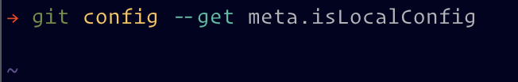
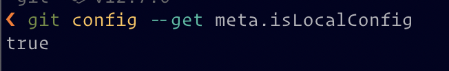

In [a previous article](/git-gpg-verified-commits/), I generated a GPG key to
sign commits in Git. I've started in a new company and generated a new key to
separate my work profile from my personal profile. In this article, I'm going to
explain how to [split your git configuration](#splitting-your-git-configuration)
and then
[conditionally include custom configuration](#include-this-file-only-for-work-repositories)
based on the current directory you're currently in.

> For the rest of this article, I'll assume you have just generated a new key
> and has the long id ready. You can check my
> [previous article](/git-gpg-verified-commits) to see how to generate a key and
> retrieve the long key.

#### Splitting your git configuration

Git has a lot of options and normally you put them in a
[`.gitconfig`](https://github.com/filipekiss/dotfiles/blob/master/sidekicks/git/.gitconfig)
file in your `$HOME` folder. What many people don't know is that you are able to
[include another `.gitconfig` file](https://git-scm.com/docs/git-config#_includes)
and — even better — we can even
[conditionally include them](https://git-scm.com/docs/git-config#_conditional_includes)
so you don't need to add some very specific stuff to your versioned `.gitconfig`
file.

The simplest way to do this is using a static include, i.e., a file that will
always be included if it exists. _If the specified file does not exists, git
**will fail silently**_.

Just so you understand how it works, we will create a `.gitconfig-local` file in
your `$HOME` folder and we'll include it. Run the following command:

```sh
git config --get meta.isLocalConfig
```



You should see no output. Now, let's add that configuration to the local file
and see if git is able to read it:

```sh
git config -f ~/.gitconfig-local meta.isLocalConfig true
```

Now we run the command again and… still no output. What's going on?

Well, we need to tell git to look for this file. The name `.gitconfig-local`
means nothing, it's just an arbitrary name. Let's tell git that we wish to
include this configuration file

```sh
git config --global include.path "~/.gitconfig-local"
```

And, finally, run again:

```sh
git config --get meta.isLocalConfig
```



Remember, the configuration in the included file will \*override\*\* any
configuration from the global `.gitconfig` file.

#### Configuring Git to use the second key

So, assuming you have your long key id ready, let's create a file for your work
configuration and add your work email:

```sh
git config -f ~/.gitconfig-work user.email <your.work@email.com>
```

After that, make sure you have the long id for your work GPG key and configure
git to use this key:

```sh
git config -f ~/.gitconfig-work user.signingkey `A5A675575744B557`
```

Your `~/.gitconfig-work` file should look something like the file below:

```gitconfig
[user]
    name = Filipe Kiss
    email = filipe.kiss@work.com
	signingkey = A5A675575744B557
```

#### Include this file only for work repositories

Now that we have a configuration file for work, we need to tell git when to use
this file. Instead of using a `include` directive, we're going to use the
`includeIf` option. For the sake of this example, let's assume you have the
following structure:

```
$HOME
├── personal
│   └── other-repository
└── work
    └── repository
```

As you can see, there's a work folder where I'd like to use my work signing key
instead of my personal one. Let's tell git to include the `~/.gitconfig-work`
file when we're in `$HOME/work/repository`:

```sh
git config --global "includeIf.gitdir:~/work/.path" "~/.gitconfig-work"
```

Now, if you open your `.gitconfig`, at the very end, you should find something
like this:

```gitconfig
[includeIf "gitdir:~/work/"]
	path = ~/.gitconfig-work
```

What this means is "if you're in a git folder that's under ~/work, include the
~/.gitconfig-work file". You can have multiple `includeIf` statements for
different setups, like work, open source or whatever.

To ensure everything works, let's add a key that's only available on
`.gitconfig-work`:

```sh
git config -f ~/.gitconfig-work core.isWork true
```

No go to any repository that's **not** under `$HOME/work` and run the following:

```sh
git config --get core.isWork || echo false
```


The output should be `false`. No go to a **git repository** under the
`$HOME/work` and run the same command and the output should be `true`


And that's how I have different git configurations depending on what I'm working
on and which I don't ever have to remember to swap one for the other: Git does
itself.
